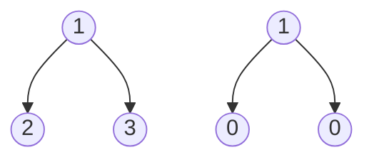
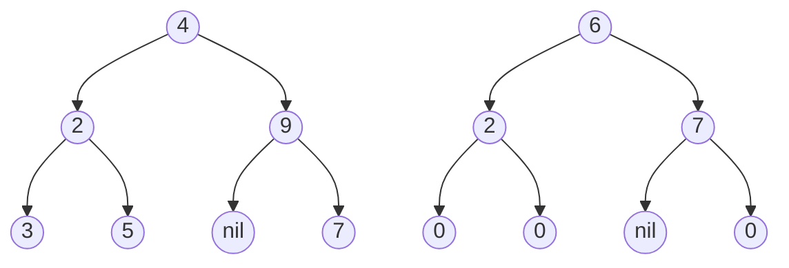
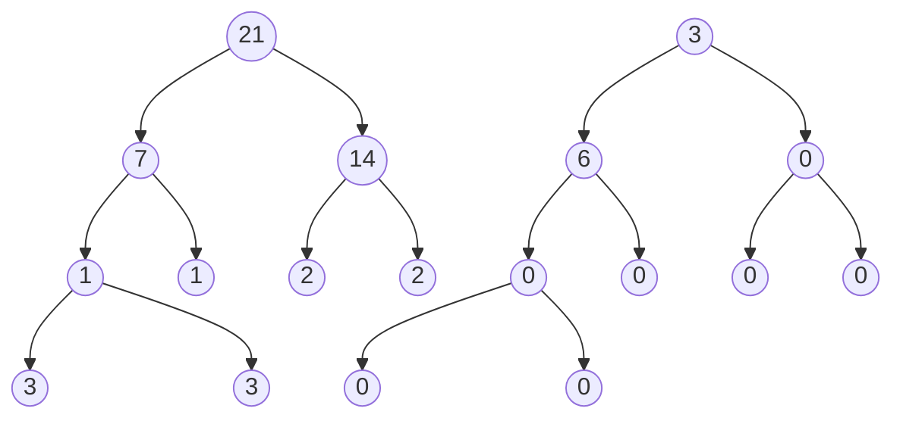

# Binary tree tilt(Easy)

## Beginners Guide

Given the `root` of a binary tree, return the sum of every tree node's **tilt**.

The **tilt** of a tree node is the **absolute difference** between the sum of all left subtree node **values** and all right subtree node **values**. If a node does not have a left child, then the sum of the left subtree node **values** is treated as `0`. The rule is similar if the node does not have a right child.

### Example 1

> Input: root = [1,2,3]
Output: 1
Explanation:
Tilt of node 2 : |0-0| = 0 (no children)
Tilt of node 3 : |0-0| = 0 (no children)
Tilt of node 1 : |2-3| = 1 (left subtree is just left child, so sum is 2; right subtree is just right child, so sum is 3)
Sum of every tilt : 0 + 0 + 1 = 1

### Example 2

> Input: root = [4,2,9,3,5,null,7]
Output: 15
Explanation:
Tilt of node 3 : |0-0| = 0 (no children)
Tilt of node 5 : |0-0| = 0 (no children)
Tilt of node 7 : |0-0| = 0 (no children)
Tilt of node 2 : |3-5| = 2 (left subtree is just left child, so sum is 3; right subtree is just right child, so sum is 5)
Tilt of node 9 : |0-7| = 7 (no left child, so sum is 0; right subtree is just right child, so sum is 7)
Tilt of node 4 : |(3+5+2)-(9+7)| = |10-16| = 6 (left subtree values are 3, 5, and 2, which sums to 10; right subtree values are 9 and 7, which sums to 16)
Sum of every tilt : 0 + 0 + 0 + 2 + 7 + 6 = 15

### Example 3

> Input: root = [21,7,14,1,1,2,2,3,3]
Output: 9

---

### Rules

* The number of nodes in the tree is in the range [0, 10$^4$].
* -1000 <= Node.val <= 1000
