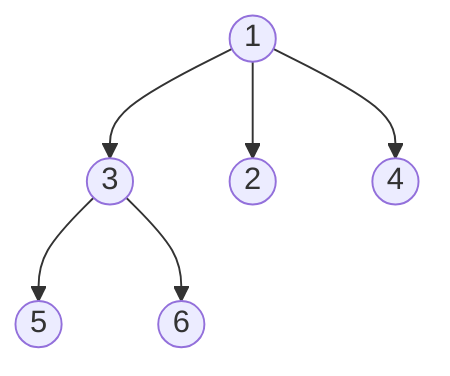
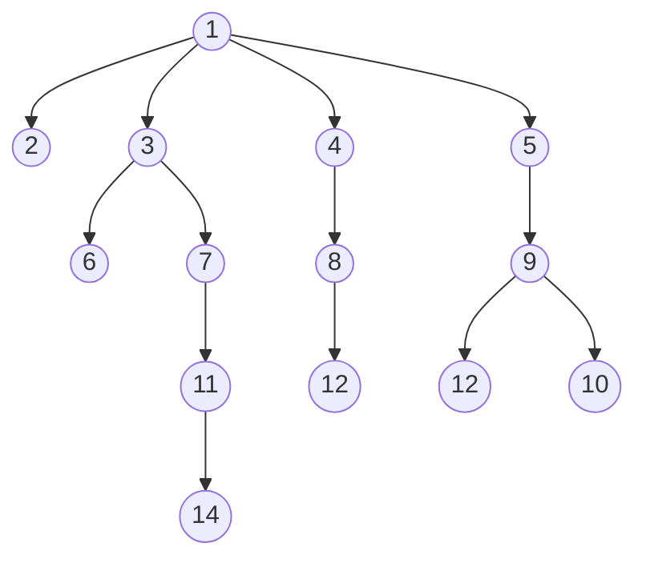

# N-ary Tree Preorder Traversal(Easy)

## Beginners Guide

Given the `root` of an n-ary tree, return the preorder traversal of its nodes' values.

Nary-Tree input serialization is represented in their level order traversal. Each group of children is separated by the null value (See examples)

### Example 1

> Input: root = [1,null,3,2,4,null,5,6]
Output: [1,3,5,6,2,4]

### Example 2

> Input: root = [1,null,2,3,4,5,null,null,6,7,null,8,null,9,10,null,null,11,null,12,null,13,null,null,14]
Output: [1,2,3,6,7,11,14,4,8,12,5,9,13,10]

---

### Rules

* The number of nodes in the tree is in the range [0, 10$^4$].
* 0 <= Node.val <= 10$^4$
* The height of the n-ary tree is less than or equal to `1000`.
