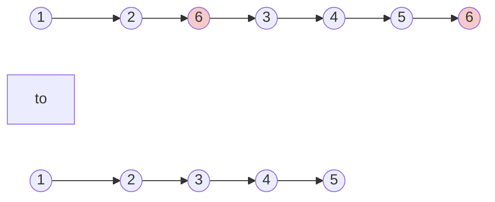

# Remove Linked List Element(Easy)

## Beginners Guide

Given the `head` of a linked list and an integer `val`, remove all the nodes of the linked list that has `Node.val == val`, and return the new head.

### Example 1

>Input: head = [1,2,6,3,4,5,6], val = 6
Output: [1,2,3,4,5]

### Example 2

>Input: head = [], val = 1
Output: []

### Example 3

>Input: head = [7,7,7,7], val = 7
Output: []

---

### Rules

* The number of nodes in the list is in the range [0, 10$^4$].
* 1 <= Node.val <= 50
* 0 <= val <= 50
