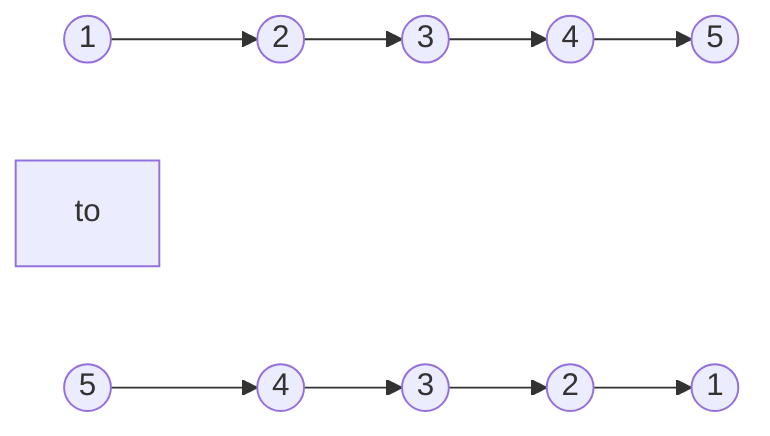
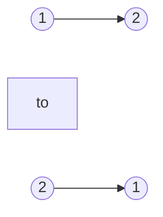

# Reverse Linked List(Easy)

## Beginners Guide

Given the `head` of a singly linked list, reverse the list, and return the reversed list.

### Example 1

>Input: head = [1,2,3,4,5]
Output: [5,4,3,2,1]

### Example 2

>Input: head = [1,2]
Output: [2,1]

### Example 3

>Input: head = []
Output: []

---

### Rules

* The number of nodes in the list is the range `[0, 5000]`.
* -5000 <= Node.val <= 5000
