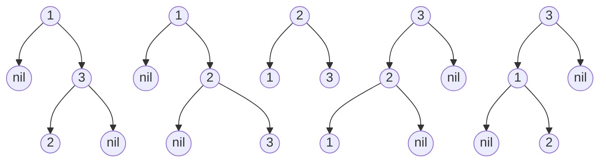

# Unique Binary Search Trees(Medium)

## Beginners Guide

Given an integer `n`, return the number of structurally unique **BST**'s (binary search trees) which has exactly `n` nodes of unique values from `1` to `n`.

### Example 1

>Input: n = 3
Output: 5

### Example 2

>Input: n = 1
Output: 1

---

### Rules

* `1 <= n <= 19`
