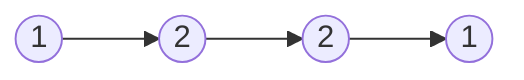
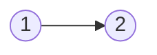

# Palindrome Linked List(Easy)

## Beginners Guide

Given the `head` of a singly linked list, return `true` if it is a palindrome or `false` otherwise.

### Example 1

> Input: head = [1,2,2,1]
Output: true
### Example 2

> Input: head = [1,2]
Output: false

---

### Rules

* The number of nodes in the list is in the range [1, 10$^5$].
* `0 <= Node.val <= 9`
