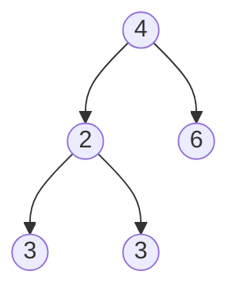
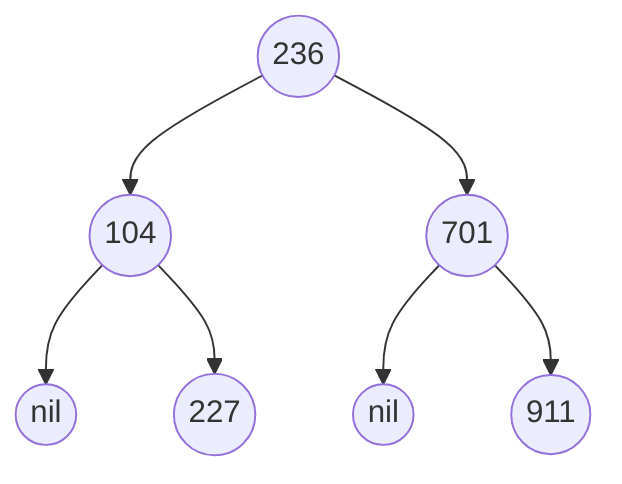

# Minimum Absolute Difference in BST(Easy)

## Beginners Guide

Given the `root` of a Binary Search Tree (BST), return *the minimum absolute difference between the values of any two different nodes in the tree*.

### Example 1

>Input: root = [4,2,6,1,3]
Output: 1

### Example 2

>Input: root = [1,0,48,null,null,12,49]
Output: 1

### Example 3

>Input: root = [236,104,701,null,227,null,911]
Output: 9

---

### Rules

* The number of nodes in the tree is in the range [2, 10$^4$].
* 0 <= Node.val <= 10$^5$
