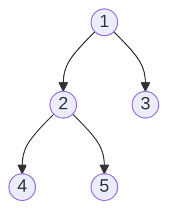
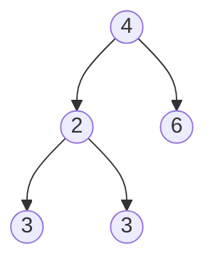

# Quest Name(Level)

## Beginners Guide

Given the `root` of a binary tree, return *the length of the **diameter** of the tree*.

The **diameter** of a binary tree is the **length** of the longest path between any two nodes in a tree. This path may or may not pass through the `root`.

The **length** of a path between two nodes is represented by the number of edges between them.

### Example 1

>Input: root = [1,2,3,4,5]
Output: 3
Explanation: 3 is the length of the path [4,2,1,3] or [5,2,1,3].

### Example 2

>Input: root = [1,2]
Output: 1
---

### Rules

* $something descript$
* something descript.
