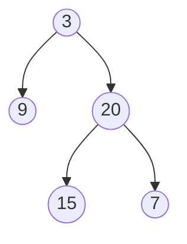

# Sum of Left Leaves(Easy)

## Beginners Guide

Given the `root` of a binary tree, return *the sum of all left leaves.*
A **leaf** is a node with no children. A **left leaf** is a leaf that is the left child of another node.

### Example 1

>Input: root = [3,9,20,null,null,15,7]
Output: 24
Explanation: There are two left leaves in the binary tree, with values 9 and 15 respectively.

### Example 2

>Input: root = [1]
Output: 0

---

### Rules

* The number of nodes in the tree is in the range `[1, 1000]`.
* `-1000 <= Node.val <= 1000`
