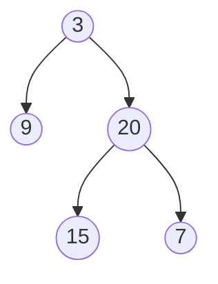

# Maximum Depth of Binary Tree(Easy)

## Beginners Guide

Given the `root` of a binary tree, return its maximum depth.

A binary tree's **maximum depth** is the number of nodes along the longest path from the root node down to the farthest leaf node.

### Example 1

> Input: root = [3,9,20,null,null,15,7]
Output: 3

### Example 2

> Input: root = [1,null,2]
Output: 2

---

### Rules

* The number of nodes in the tree is in the range [1, 10$^4$].
* -100 <= Node.val <= 100
