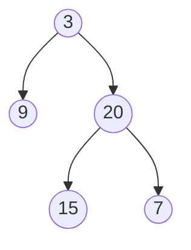

# Minimum Depth of Binary Tree(Easy)

## Beginners Guide

Given a binary tree, find its minimum depth.

The minimum depth is the number of nodes along the shortest path from the root node down to the nearest leaf node.

**Note**: A leaf is a node with no children.

### Example 1

> Input: root = [3,9,20,null,null,15,7]
Output: 2

### Example 2

> Input: root = [2,null,3,null,4,null,5,null,6]
Output: 5

---

### Rules

* The number of nodes in the tree is in the range [0, 10$^5$].
* -1000 <= Node.val <= 1000
