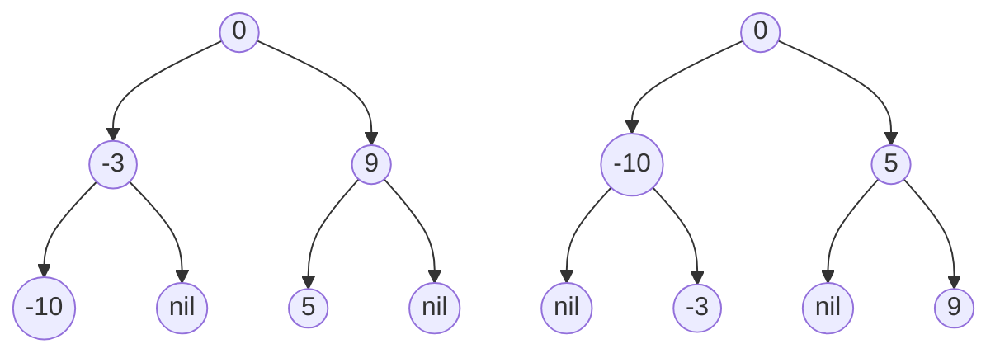
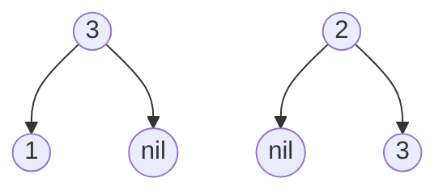

# Convert Sorted Arrat to Binary Search Tree(Level)

## Beginners Guide

Given an integer array (nums) wheretje elements are sorted in **ascending order**, convert it to a height-balanced binary search tree.

### Example 1

> Input: nums = [-10,-3,0,5,9]
Output: [0,-3,9,-10,null,5]
Explanation: [0,-10,5,null,-3,null,9] is also accpeted.

### Example 2

> Input: nums = [1,3]
Output: [3,1]
Explanation: [1,null,3] or [3,1] are both height-balanced BSTs.

---

### Rules

* 1 <= nums.length <= 10$^4$
* -10^4 <= nums[i] <= 10$^4$
* `nums` is sorted in a **strictly increasing** order.
