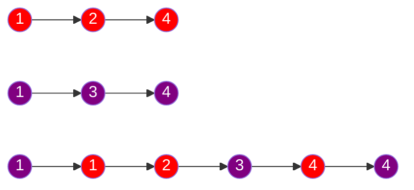

# Merge Two Sorted Lists(Easy)

## Beginners Guide

You are given the heads of two sorted linked lists `list1` and `list2`.

Merge the two lists into one sorted list. The list should be made by splicing together the nodes of the first two lists.

Return the head of the merged linked list.

### Example 1

> Input: l1 = [1,2,4], l2 = [1,3,4]
Output: [1,1,2,3,4,4]

### Example 2

> Input: l1 = [], l2 = []
Output: []

### Example 3

> Input: l1 = [], l2 = [0]
Output: [0]

---

### Rules

* The number of nodes in both lists is in the range [0, 50].
* -100 <= Node.val <= 100
* Both `list1` and `list2` are sorted in non-decreasing order.
