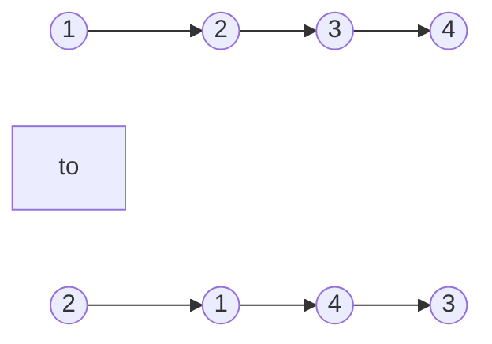

# Quest Name(Level)

## Beginners Guide

Quest descript

### Example 1

>Input: head = [1,2,3,4]
Output: [2,1,4,3]

### Example 2

>Input: head = []
Output: []

### Example 3

>Input: head = [1]
Output: [1]

---

### Rules

* The number of nodes in the list is in the range `[0, 100]`.
* `0 <= Node.val <= 100`
